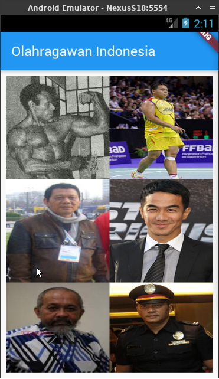
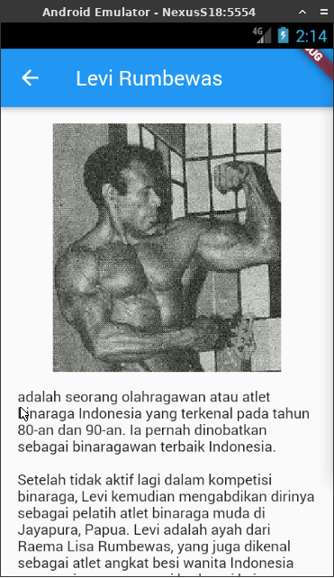

# olahragawan_indonesia ( Tugas 2 )
Daftar olahragawan

## Screenshot

## Built With
Flutter

## Created By
Syahrizal Akbar

## OSG 05 Eudeka!
Kelas belajar flutter basic

## Eudeka! OSG 05
Dengan jangka waktu lebih kurang 2 bulan, peserta diharapkan dapat membuat aplikasi android dengan flutter.

## Cara Mendaftar OSG 05
Melalui website Eudeka.

## Info Lebih Lengkap
Website : [www.eudeka.id](https://www.eudeka.id).  
Twitter: [@EudekaID](https://twitter.com/EudekaID).  
Telegram : [@eudekainfo](https://t.me/eudekainfo).  
Instagram : [@eudeka.id](https://instagram.com/eudeka.id).  
WhatsApp : [0895351577557](https://wa.me/62895351577557).  
Email : [info@eudeka.id](mailto:info@eudeka.id).  

[nama_project]: Peserta
[tentang_project]: Peserta
[screenshot_project]: Peserta
[teknologi_digunakan]: Peserta
[nama_peserta]: Peserta

[kode_tugas]: Eudeka
[jenis_kelas]: Eudeka
[nama_kelas]: Eudeka
[tentang_kelas]: Eudeka
[waktu_kelas]: Eudeka
[tujuan_kelas]: Eudeka
[cara_daftar]: Eudeka
[kode_kelas]: Eudeka

###### tags: `Templates` `Eudeka`